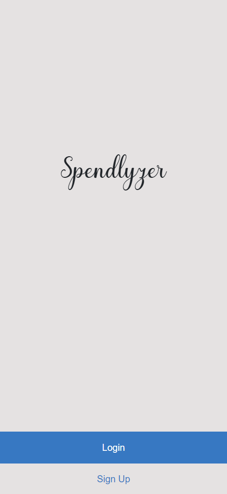

# Budget App

> The project is about building a mobile web application where you can manage your budget: you have a list of transactions associated with a category, so that you can see how much money you spent and on what. You will create a Ruby on Rails application that allows the user to: register and log in, so that the data is private to them. introduce new transactions associated with a category. see the money spent on each category.

# Screenshots

- [Live Link](https://rocky-beach-51249.herokuapp.com/)

## Run the project

`rails s`

## Built With

- Ruby
- Ruby on Rails
- Rubocop
- Bootstrap
- Gems
  - Rspec
  - Capybara
  - Cancancan
  - Devise

## Prerequisites

- postgresql database in your machine

## Getting Started

To get a local copy up and running follow these simple example steps.

- for SSH:
  - `git clone git@github.com:vikipretium/budget-app.git`
- for https:
  - `git clone https://github.com/vikipretium/budget-app.git`

then run:

- `bundle install`
- `npm install`

## Run tests

Run `rspec`

## Authors

👤 **Vignesh**

- GitHub: [@vikipretium](https://github.com/vikipretium)
- Twitter: [@vikipretium](https://twitter.com/vikipretium)
- LinkedIn: [vikipretium](https://linkedin.com/in/vikipretium)

## 🤝 Contributing

Contributions, issues, and feature requests are welcome!

Feel free to check the [issues page](https://github.com/vikipretium/budget-app/issues).

## Show your support

Give a ⭐️ if you like this project!

## Acknowledgments

- Microverse: [microverse community](https://github.com/microverseinc)

- Original design idea by [Snapscan - iOs design and branding](https://www.behance.net/gallery/19759151/Snapscan-iOs-design-and-branding?tracking_source=)

## 📝 License

This project is [MIT](./MIT.md) licensed.

- [Creative Common License of design](https://creativecommons.org/licenses/by-nc/4.0/)
